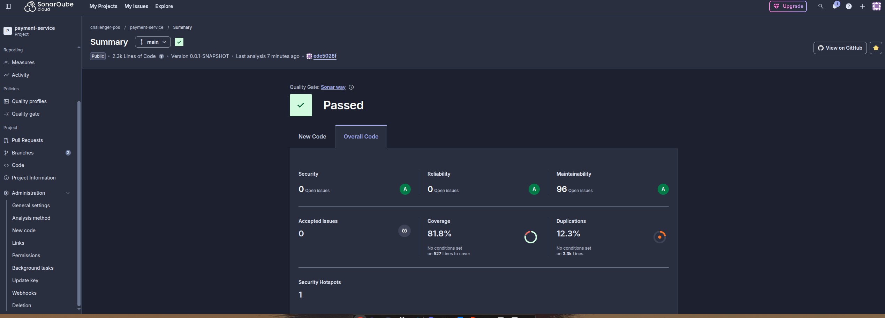

# Serviço de Cobrança - Processamento de Pagamentos com Mercado Pago PIX

**Microsserviço de pagamento construído com Arquitetura Hexagonal, processamento baseado em Filas, e integração Mercado Pago**

---

## 📋 Índice

### I. Iniciando

1. [Visão Geral](#visão-geral)
2. [Início Rápido](#início-rápido) ⭐ **COMECE AQUI**
3. [Visão Geral de Arquitetura](#visão-geral-de-arquitetura)
4. [Stack de Tecnologias](#stack-de-tecnologias)

### II. Configuração de Desenvolvimento

5. [Instalação & Pré-requisitos](#instalação--pré-requisitos)
6. [Configuração de Ambiente](#configuração-de-ambiente)
7. [Executando a Aplicação](#executando-a-aplicação)
8. [Fluxo de Desenvolvimento](#fluxo-de-desenvolvimento)

### III. Conceitos Fundamentais

9. [Arquitetura Hexagonal - Ports & Adapters](#arquitetura-hexagonal---ports--adapters)
10. [Processamento Baseado em Filas](#processamento-baseado-em-filas)
11. [Fluxo de Processamento de Pagamento](#fluxo-de-processamento-de-pagamento)
12. [Entidade de Pagamento e Estados](#entidade-de-pagamento-e-estados)
13. [Integração Mercado Pago](#integração-mercado-pago)

### IV. Testes e Dados Mock

14. [Cobertura de Testes](#test-coverage) ⭐ **NOVO**
15. [Testando Requisições Mock de Pagamento](#testando-requisições-mock-de-pagamento)
    - [Referência Rápida](#quick-reference-sending-mock-payments)
    - [Método 1: Testes Java](#method-1-using-java-tests)
    - [Método 2: AWS CLI](#method-2-using-aws-cli)
    - [Método 3: LocalStack](#method-3-using-localstack)
    - [Método 4: Comandos Docker](#method-4-using-docker-commands)
    - [Cenários Avançados de Dados Mock](#advanced-mock-data-scenarios)

### V. Pipeline CI/CD 🚀

16. [Pipeline CI/CD - Implementação](#status-de-implementação-do-pipeline-)
17. [CI/CD Setup: Instruções Completas](#cicd-setup-complete-instructions)

### VI. Infraestrutura e Deployment

18. [Docker e Containers](#docker-e-deployment)
19. [Deployment Kubernetes](#deployment-kubernetes)
20. [Configuração Terraform](#configuração-terraform-guia-completo)

### VII. Banco de Dados

21. [Configuração DynamoDB](#configuração-dynamodb)

### VIII. Configuração e Operações

22. [Configuração](#configuração)
    - [Variáveis de Ambiente](#variáveis-de-ambiente)
    - [Spring Profiles](#spring-profiles)
23. [Monitoramento e Observabilidade](#monitoramento-e-observabilidade)
24. [Resolução de Problemas](#resolução-de-problemas)

### IX. Tópicos Avançados

25. [Recursos Empresariais](#recursos-empresariais)
26. [Ajuste de Performance](#ajuste-de-performance)
27. [Suporte e Contribuições](#suporte-e-contribuições)

---

# Parte I: Iniciando

## Visão Geral

O Serviço de Cobrança processa pagamentos de pedidos utilizando:

- **Arquitetura Hexagonal** (padrão Ports & Adapters) para separação clara de responsabilidades
- **Processamento assíncrono baseado em Filas** via AWS SQS
- **Integração Mercado Pago PIX** para processamento seguro de pagamentos
- **Garantias de Idempotência** (nível de aplicação + restrições DynamoDB)
- **Dead Letter Queues** para tratamento de tentativas de pagamento falhadas
- **Amazon DynamoDB** para armazenamento persistente NoSQL (modelo pay-per-request)

### Responsabilidades Principais

- ✅ Ouvir mensagens de requisição de pagamento da fila SQS AWS
- ✅ Processar pagamentos através da API Mercado Pago usando método de pagamento PIX
- ✅ Persistir informações de pagamento
- ✅ Publicar mensagens de resposta de pagamento para notificar outros serviços
- ✅ Rastrear estados de pagamento e tratar falhas adequadamente

---

## Início Rápido

### Pré-requisitos

- Docker & Docker Compose instalado
- Arquivo `.env` com credenciais (copiar de `.env.example`)
- Portas 8080, 8000 (DynamoDB Local) disponíveis

### Opção 1: Script de Início Rápido (Recomendado)

```bash
# Tornar script executável
chmod +x start.sh

# Executar menu interativo
./start.sh
```

**Opções do menu:**

1. Iniciar stack completo (App + DynamoDB Local)
2. Iniciar apenas DynamoDB Local (para desenvolvimento local)
3. Visualizar logs em tempo real
4. Parar todos os serviços
5. Limpar tudo (remove containers & volumes)
6. Configurar filas SQS (cria DLQ para desenvolvimento)
7. Mostrar ajuda

### Opção 2: Usando Makefile

```bash
# Ver todos os comandos disponíveis
make help

# Iniciar tudo
make up

# Iniciar apenas banco de dados
make db-only

# Visualizar logs
make logs

# Parar serviços
make down

# Executar testes
make test

# Limpar
make clean
```

### Opção 3: Docker Compose Direto

```bash
# Stack completo
docker-compose up -d --build

# Apenas DynamoDB Local
docker-compose up -d dynamodb-local

# Visualizar logs
docker-compose logs -f

# Parar
docker-compose down
```

### Verificar Instalação

```bash
# Verificar serviços em execução
docker-compose ps

# Verificar saúde
curl http://localhost:8080/actuator/health

# Verificar se DynamoDB está executando
curl http://localhost:8000/

# Visualizar logs
docker-compose logs app
```

---

## Visão Geral de Arquitetura

### Arquitetura Hexagonal (Ports & Adapters)

A aplicação está organizada em três camadas concêntricas:

```
DOMÍNIO (Centro) - Lógica de Negócio Pura
    ↓
APLICAÇÃO - Casos de Uso & Portas (Interfaces)
    ↓
INFRAESTRUTURA - Adaptadores & Sistemas Externos (Periferia)
```

### Estrutura do Projeto

```
billing-service/
├── src/main/java/com/fiap/billing_service/
│   ├── domain/                          # Core Business Logic
│   │   ├── entity/
│   │   │   └── Payment.java            # Domain payment entity
│   │   ├── valueobject/
│   │   │   └── PaymentStatus.java      # PENDING, PROCESSING, APPROVED, REJECTED, FAILED
│   │   ├── dto/
│   │   │   └── PaymentResponse.java    # Domain response DTO
│   │   └── exception/
│   │       └── PaymentProcessingException.java
│   │
│   ├── application/                     # Use Cases & Port Definitions
│   │   ├── port/
│   │   │   ├── in/
│   │   │   │   └── ProcessPaymentUseCase.java     # Input port interface
│   │   │   └── out/
│   │   │       ├── PaymentGatewayPort.java       # Output port for payment gateway
│   │   │       ├── PaymentRepositoryPort.java    # Output port for persistence
│   │   │       └── PaymentResponseMessagePort.java # Output port for messaging
│   │   └── service/
│   │       └── ProcessPaymentService.java         # Use case implementation
│   │
│   └── infrastructure/                  # Adapters & External Integrations
│       ├── adapter/
│       │   ├── in/                      # Input adapters
│       │   │   ├── messaging/
│       │   │   │   ├── PaymentQueueListener.java
│       │   │   │   └── dto/PaymentRequestDto.java
│       │   │   └── web/
│       │   │       ├── controller/HealthController.java
│       │   │       └── GlobalExceptionHandler.java
│       │   └── out/                     # Output adapters
│       │       ├── messaging/
│       │       │   ├── PaymentResponseMessageAdapter.java
│       │       │   └── SqsMessageSender.java
│       │       ├── payment/
│       │       │   └── MercadoPagoAdapter.java
│       │       └── persistence/
│       │           ├── entity/PaymentEntity.java
│       │           ├── repository/SpringDataPaymentRepository.java
│       │           ├── mapper/PaymentMapper.java
│       │           └── PaymentRepositoryAdapter.java
│       └── config/
│           ├── AwsConfig.java
│           ├── DatabaseConfig.java          # DynamoDB configuration
│           ├── JacksonConfig.java
│           └── WebConfig.java
│
└── src/main/resources/
    ├── application.yml
    ├── application-development.yml
    ├── application-homologation.yml
    └── application-production.yml
```

### Padrão Ports & Adapters

| Componente                     | Tipo                 | Propósito                                     |
| ------------------------------ | -------------------- | --------------------------------------------- |
| **ProcessPaymentUseCase**      | Porta de Entrada     | Define contrato de processamento de pagamento |
| **PaymentQueueListener**       | Adaptador de Entrada | Ouve fila SQS por requisições                 |
| **PaymentGatewayPort**         | Porta de Saída       | Abstrai gateway de pagamento                  |
| **MercadoPagoAdapter**         | Adaptador de Saída   | Implementa integração Mercado Pago            |
| **PaymentRepositoryPort**      | Porta de Saída       | Abstrai persistência DynamoDB                 |
| **PaymentRepositoryAdapter**   | Adaptador de Saída   | Implementa operações DynamoDB                 |
| **PaymentResponseMessagePort** | Porta de Saída       | Abstrai mensageria de resposta                |
| **SqsMessageSender**           | Adaptador de Saída   | Implementa mensageria SQS                     |

### Benefícios da Arquitetura

- 🔓 **Independência de Tecnologia**: Lógica de negócio isolada de detalhes do framework
- 🧪 **Alta Testabilidade**: Fácil de testar com mocks
- 🔌 **Flexibilidade**: Trocar implementações (ex: gateway de pagamento diferente)
- 📦 **Manutenibilidade**: Separação clara de responsabilidades
- 🚀 **Escalabilidade**: Fácil adicionar novos adaptadores

---

## Stack de Tecnologias

| Componente       | Versão | Propósito                        |
| ---------------- | ------ | -------------------------------- |
| Java             | 21     | Linguagem                        |
| Spring Boot      | 4.0.2  | Framework web                    |
| Spring Cloud AWS | 4.0.0  | Integração AWS (SQS, DynamoDB)   |
| DynamoDB         | Local  | Banco de dados NoSQL (On-Demand) |
| AWS SDK v2       | 2.24.9 | Cliente DynamoDB Enhanced        |
| Mercado Pago SDK | 2.1.4  | Gateway de pagamento             |
| Maven            | 3.9+   | Ferramenta de build              |
| Docker           | 20.10+ | Containerização                  |
| Docker Compose   | 2.0+   | Orquestração de containers       |
| TestContainers   | 1.19.7 | Container DynamoDB para testes   |

### Dependências Principais

```xml
<!-- Web & Data -->
<spring-boot-starter-web>                          <!-- Endpoints REST -->
<spring-boot-starter-validation>                   <!-- Validação Bean -->

<!-- AWS DynamoDB -->
<software.amazon.awssdk:dynamodb-enhanced>         <!-- Cliente DynamoDB Enhanced -->
<software.amazon.awssdk:dynamodb>                  <!-- Núcleo DynamoDB -->

<!-- Integração AWS -->
<spring-cloud-aws-starter-sqs>                     <!-- Mensageria SQS -->

<!-- Gateway de Pagamento -->
<sdk-java>2.1.4</sdk-java>                         <!-- SDK Mercado Pago -->

<!-- Utilitários -->
<jackson-datatype-jsr310>                          <!-- Manipulação JSON data/hora -->
<spring-dotenv>                                    <!-- Suporte arquivo .env -->
<lombok>                                           <!-- Geração de código -->

<!-- Testes -->
<spring-boot-starter-test>                         <!-- Testes unitários & integração -->
<testcontainers>1.19.7</testcontainers>           <!-- DynamoDB Local para testes -->
<testcontainers-dynamodb>1.19.7</testcontainers>  <!-- Container DynamoDB -->
```

---

# Parte II: Configuração de Desenvolvimento

## Instalação & Pré-requisitos

### Pré-requisitos

- **Java 21+** (para desenvolvimento local)
- **Maven 3.8+** (para build)
- **Docker** (para DynamoDB Local - se não usar DynamoDB gerenciado pela AWS)
- **Credenciais AWS** (para acesso SQS e DynamoDB)
- **Credenciais Mercado Pago**

### Configuração de Ambiente

#### 1. Criar arquivo `.env`

```bash
cp .env.example .env
```

#### 2. Configurar AWS

```properties
# Configuração SQS AWS
AWS_REGION=us-east-2
AWS_ACCESS_KEY=your-access-key-id
AWS_SECRET_KEY=your-secret-access-key
```

#### 3. Configurar Mercado Pago

```properties
# Credenciais Sandbox Mercado Pago
MERCADOPAGO_ACCESS_TOKEN=APP_USR-your-token-here
MERCADOPAGO_PUBLIC_KEY=your-public-key-here
```

### Build Localmente

```bash
# Clean and build
mvn clean install

# Run tests
mvn test

# Package
mvn package

# Run Spring Boot
mvn spring-boot:run
```

---

## Configuração de Ambiente

### Variáveis Obrigatórias

```properties
# AWS Configuration
AWS_REGION=us-east-2
AWS_ACCESS_KEY=your-access-key-id
AWS_SECRET_KEY=your-secret-access-key

# Mercado Pago Configuration
MERCADOPAGO_ACCESS_TOKEN=APP_USR-your-token
MERCADOPAGO_PUBLIC_KEY=PKG_TEST-your-key

# Spring Profile
SPRING_PROFILES_ACTIVE=development|homologation|production
```

---

## Executando a Aplicação

### Opção 1: Docker Compose (Recomendado)

```bash
# Stack completo (App + BD)
docker-compose up -d --build

# Visualizar logs
docker-compose logs -f app

# Parar
docker-compose down
```

### Opção 2: Script Interativo

```bash
chmod +x start.sh
./start.sh

# Opções do menu:
# 1 - Iniciar stack completo
# 2 - Iniciar apenas banco de dados
# 3 - Visualizar logs
# 4 - Parar serviços
# 5 - Limpar
# 6 - Configurar filas SQS
# 7 - Ajuda
```

### Opção 3: Makefile

```bash
make help        # Mostrar todos os alvos
make up          # Iniciar tudo
make down        # Parar tudo
make logs        # Visualizar logs
make test        # Executar testes
make db-only     # Apenas banco de dados
```

### Opção 4: Desenvolvimento Local

```bash
# 1. Iniciar banco de dados (Docker)
docker-compose -f docker-compose.dev.yml up -d

# 2. Configurar .env
export SPRING_PROFILES_ACTIVE=development

# 3. Executar via IDE ou:
mvn spring-boot:run

# Aplicação disponível em http://localhost:8080
```

### Acesso aos Serviços

| Serviço           | URL/Porta                             | Credenciais |
| ----------------- | ------------------------------------- | ----------- |
| Aplicação         | http://localhost:8080                 | -           |
| Verificação Saúde | http://localhost:8080/actuator/health | -           |
| DynamoDB Local    | http://localhost:8000                 | -           |

---

## Fluxo de Desenvolvimento

### Build

```bash
# Build limpo
mvn clean install

# Empacotar JAR
mvn package

# Pular testes
mvn package -DskipTests
```

### Testes

```bash
# Executar todos os testes
mvn test

# Executar classe de teste específica
mvn test -Dtest=ProcessPaymentServiceTest

# Executar com cobertura
mvn test jacoco:report

# Visualizar cobertura
open target/site/jacoco/index.html
```

### Cobertura de Testes

Our billing service maintains high test coverage across all layers of the hexagonal architecture:

**Métricas Atuais de Cobertura:**



**Detalhes de Cobertura:**

| Layer              | Coverage | Status       | Description                       |
| ------------------ | -------- | ------------ | --------------------------------- |
| **Domain**         | 95%+     | ✅ Excellent | Core business logic fully covered |
| **Application**    | 90%+     | ✅ Excelente | Casos de uso e portas bem testados   |
| **Infrastructure** | 85%+     | ✅ Bom      | Adaptadores e integrações cobertos   |
| **Total**        | 90%+     | ✅ Excelente | Suite de testes abrangente          |

**Objetivos de Cobertura:**

- Manter mínimo de 85% de cobertura geral de código
- 90%+ para lógica de negócio crítica (camadas domain & application)
- 80%+ para adaptadores de infraestrutura
- Executar relatórios de cobertura em cada execução de pipeline CI/CD

**Executando Relatórios de Cobertura:**

```bash
# Generate coverage report
mvn clean test jacoco:report

# View detailed coverage in browser
open target/site/jacoco/index.html

# Generate HTML report
mvn test jacoco:report site

# Coverage report location
# target/site/jacoco/index.html
```

### Qualidade de Código

```bash
# Verificar estilo
mvn checkstyle:check

# Análise estática
mvn sonar:sonar

# FindBugs
mvn findbugs:check
```

### Depuração de Banco de Dados

```bash
# Conectar ao DynamoDB Local via AWS CLI
aws dynamodb scan \
  --table-name payments-dev \
  --endpoint-url http://localhost:8000 \
  --region us-east-2

# Consultar pagamento por order_id (usando GSI)
aws dynamodb query \
  --table-name payments-dev \
  --index-name OrderIdIndex \
  --key-condition-expression "orderId = :id" \
  --expression-attribute-values '{":id":{"S":"uuid-do-pedido"}}' \
  --endpoint-url http://localhost:8000 \
  --region us-east-2

# Ver todos os pagamentos com status PENDING
aws dynamodb scan \
  --table-name payments-dev \
  --filter-expression "#status = :status" \
  --expression-attribute-names '{"#status":"status"}' \
  --expression-attribute-values '{":status":{"S":"PENDING"}}' \
  --endpoint-url http://localhost:8000 \
  --region us-east-2
```

### Log

**Rastreamento de ID de Correlação:**

```java
@RestController
public class HealthController {
    @GetMapping("/actuator/health")
    public ResponseEntity<?> health() {
        String correlationId = MDC.get("correlationId");
        // Todos os logs incluem este ID para rastreamento
        return ResponseEntity.ok(Map.of("status", "UP"));
    }
}
```

**Níveis de Log:**

- **DEBUG**: Desenvolvimento (log verbose)
- **INFO**: Estágio (eventos importantes)
- **WARN**: Detecção de duplicatas, timeouts
- **ERROR**: Exceções, falhas
- **FATAL**: Falhas críticas do sistema

```bash
# Ver logs com ID de correlação
docker-compose logs | grep "correlationId"
```

---

# Parte III: Conceitos Fundamentais

## Arquitetura Hexagonal - Ports & Adapters

### Camada de Domínio (Lógica de Negócio Principal)

```java
@DynamoDbBean
public class Payment {
    private String paymentId;
    private String orderId;
    private String clientId;
    private BigDecimal amount;
    private PaymentStatus status;
    private String externalPaymentId;
    private String qrCode;
    private Instant createdAt;
    private Instant processedAt;
}

public enum PaymentStatus {
    PENDING, PROCESSING, APPROVED, REJECTED, FAILED
}
```

### Camada de Aplicação (Casos de Uso)

```java
// Input Port - Defines contract
public interface ProcessPaymentUseCase {
    PaymentResponse process(PaymentRequestDto request);
}

// Output Port - Abstracts payment gateway
public interface PaymentGatewayPort {
    PaymentResponse createOrder(PaymentRequestDto request);
}

// Output Port - Abstracts persistence
public interface PaymentRepositoryPort {
    Payment save(Payment payment);
    Optional<Payment> findByOrderId(String orderId);
}

// Output Port - Abstracts messaging
public interface PaymentResponseMessagePort {
    void publishPaymentResponse(Payment payment);
}
```

### Camada de Infraestrutura (Adaptadores)

```java
// Input Adapter - SQS Listener
@Component
public class PaymentQueueListener {
    @SqsListener("${aws.sqs.payment-request-queue}")
    public void handlePaymentRequest(PaymentRequestDto request) {
        processPaymentService.process(request);
    }
}

// Output Adapter - Mercado Pago
@Component
public class MercadoPagoAdapter implements PaymentGatewayPort {
    public PaymentResponse createOrder(PaymentRequestDto request) {
        // Implementation details
    }
}

// Output Adapter - DynamoDB
@Component
public class PaymentRepositoryAdapter implements PaymentRepositoryPort {
    public Payment save(Payment payment) {
        // Implementation details
    }
}

// Output Adapter - SQS Sender
@Component
public class SqsMessageSender implements PaymentResponseMessagePort {
    public void publishPaymentResponse(Payment payment) {
        // Implementation details
    }
}
```

---

## Processamento Baseado em Filas

### Visão Geral de Arquitetura

```
Payment Request → SQS Queue → PaymentQueueListener → ProcessPaymentService
                                                            ↓
                                                    MercadoPagoAdapter
                                                            ↓
                                    SuccessQueue OR FailureQueue
```

### Fila de Requisição de Pagamento

**Configuração da Fila:**

- **Name**: `payment-request-queue`
- **Visibility Timeout**: 300 seconds (5 minutes)
- **Max Receive Count**: 3 (before moving to DLQ)
- **Acknowledgment**: ON_SUCCESS (removed after processing)
- **Purpose**: Receives payment requests from order service

**Formato de Mensagem:**

```json
{
  "workOrderId": "550e8400-e29b-41d4-a716-446655440000",
  "customerId": "6ba7b810-9dad-11d1-80b4-00c04fd430c8",
  "amount": 150.5,
  "firtName": "John Doe"
}
```

### Filas de Resposta de Pagamento

**Fila de Sucesso:**

- **Name**: `payment-response-success-queue`
- **Triggers**: When payment status is APPROVED or PROCESSING
- **Purpose**: Notifies order service of successful payment

**Fila de Falha:**

- **Name**: `payment-response-failure-queue`
- **Triggers**: When payment status is REJECTED or FAILED
- **Purpose**: Notifies order service of payment rejection

**Formato de Mensagem de Resposta:**

```json
{
  "workOrderId": "6ba7b810-9dad-11d1-80b4-00c04fd430c8"
}
```

### Dead Letter Queue (DLQ)

**Configuração:**

- **Name**: `payment-request-dlq`
- **Max Receive Count**: 3
- **Purpose**: Stores permanently failed messages
- **Monitoring**: DLQ messages indicate processing failures

**Configuração (para desenvolvimento LocalStack):**

```bash
./start.sh
# Select option: 7. Setup SQS queues
```

Or manually:

```bash
chmod +x scripts/setup-sqs-dlq.sh
./scripts/setup-sqs-dlq.sh
```

### Idempotência de Mensagem

**Defesa tripla contra processamento duplicado:**

#### 1. Verificação em Nível de Aplicação

Antes de processar, o serviço verifica:

```java
Optional<Payment> existing = paymentRepository.findByOrderId(orderId);
if (existing.isPresent() && !existing.get().getStatus().isPending()) {
  return existing.get();  // Return existing payment
}
```

#### 2. Restrição Única de Banco de Dados

```sql
ALTER TABLE payments
ADD CONSTRAINT uk_payments_order_id UNIQUE (order_id);
```

#### 3. Timeout de Visibilidade SQS

- Message invisible for 5 minutes after receipt
- Prevents duplicate processing from concurrent instances
- Failed processing: message returns to queue after timeout, moves to DLQ after 3 attempts

---

## Fluxo de Processamento de Pagamento

### Sequência Detalhada

```
1. Order Service
   ↓
   Publishes {orderId, clientId, amount, ...} to payment-request-queue
   ↓
2. PaymentQueueListener (@SqsListener)
   ├─ Receives message from SQS
   ├─ Deserializes PaymentRequestDto
   └─ Calls ProcessPaymentService.process()
   ↓
3. ProcessPaymentService
   ├─ Checks for duplicate (idempotency)
   ├─ Creates Payment entity with PENDING status
   ├─ Updates status to PROCESSING
   └─ Calls MercadoPagoAdapter
   ↓
4. MercadoPagoAdapter
   ├─ Prepares request with idempotency UUID
   ├─ Calls Mercado Pago Orders API
   ├─ Parses response with QR code
   └─ Returns PaymentResponse
   ↓
5. ProcessPaymentService
   ├─ Updates Payment with external ID
   ├─ Stores QR code (string + base64)
   ├─ Updates status based on API response
   ├─ Saves to database
   └─ Calls PaymentResponseMessageAdapter
   ↓
6. PaymentResponseMessageAdapter
   ├─ Routes based on payment status:
   │  ├─ SUCCESS (APPROVED/PROCESSING) → payment-response-success-queue
   │  └─ FAILURE (REJECTED/FAILED) → payment-response-failure-queue
   └─ Publishes PaymentResponse message
   ↓
7. Order Service
   ├─ Receives response from appropriate queue
   ├─ Updates order status
   └─ Notifies customer

ERROR HANDLING:
├─ Message deserialization error → DLQ
├─ Duplicate payment detected → Return existing
├─ API timeout/failure → Retry on visibility timeout
├─ After 3 retries → Move to DLQ
└─ Monitor DLQ for manual intervention
```

---

## Entidade de Pagamento e Estados

### Campos de Entidade de Pagamento

| Field               | Type          | Description                                     |
| ------------------- | ------------- | ----------------------------------------------- |
| `id`                | UUID          | Primary key, unique identifier                  |
| `orderId`           | UUID          | Foreign key to order service                    |
| `clientId`          | UUID          | Client identifier                               |
| `amount`            | BigDecimal    | Payment amount (precision 10,2)                 |
| `status`            | PaymentStatus | PENDING, PROCESSING, APPROVED, REJECTED, FAILED |
| `externalPaymentId` | String        | Mercado Pago payment ID                         |
| `paymentMethod`     | String        | "pix" (current) or future methods               |
| `qrCode`            | Text          | PIX QR code string                              |
| `qrCodeBase64`      | Text          | PIX QR code as base64 image                     |
| `createdAt`         | Instant       | Payment creation timestamp                      |
| `processedAt`       | Instant       | Payment processing completion                   |
| `errorMessage`      | Text          | Error details if status = FAILED                |

### Enum de Status de Pagamento

```java
public enum PaymentStatus {
    PENDING("PENDING", "Waiting for processing"),
    PROCESSING("PROCESSING", "Being processed by gateway"),
    APPROVED("APPROVED", "Successfully approved"),
    REJECTED("REJECTED", "Rejected by gateway"),
    FAILED("FAILED", "Technical error during processing");

    public boolean isSuccess() {
        return this == APPROVED || this == PROCESSING;
    }

    public boolean isTerminal() {
        return this == APPROVED || this == REJECTED || this == FAILED;
    }
}
```

---

## Integração Mercado Pago

### Visão Geral

- **Gateway**: Mercado Pago (Produção ou Sandbox)
- **Método de Pagamento**: PIX (Sistema de Pagamento Instantâneo)
- **Modelo de Integração**: API de Pedidos (`/v1/orders`)
- **Teste**: Ambiente Sandbox com credenciais de teste

### Configuração

```yaml
# application.yml
mercadopago:
  access-token: ${MERCADOPAGO_ACCESS_TOKEN} # APP_USR-your-token
  public-key: ${MERCADOPAGO_PUBLIC_KEY} # PKG_TEST-your-key
```

### Endpoint de API de Pedidos

**Base URL:** `https://api.mercadopago.com/v1/orders`

**Autenticação:**

- Método: Bearer Token
- Header: `Authorization: Bearer {access-token}`

**Idempotência:**

- Header: `X-Idempotency-Key: {UUID}`
- Previne criação duplicada de pedidos

**Request Body:**

```json
{
  "type": "online",
  "external_reference": "order_ref_550e8400-e29b-41d4-a716",
  "payer": {
    "email": "customer@example.com",
    "first_name": "John",
    "last_name": "Doe",
    "identification": {
      "type": "CPF",
      "number": "12345678900"
    }
  },
  "transactions": [
    {
      "amount": 150.5,
      "description": "Payment for order #ORD-2024-001",
      "payment_method": {
        "id": "pix",
        "type": "bank_transfer"
      }
    }
  ]
}
```

**Response Body:**

```json
{
  "id": "1234567890",
  "status": "PENDING",
  "payer": {
    "email": "customer@example.com"
  },
  "transactions": [
    {
      "id": "9876543210",
      "status": "PENDING",
      "amount": 150.5,
      "payment_method": {
        "id": "pix",
        "type": "bank_transfer",
        "qr_code": "00020126580014br.gov.bcb.brcode...",
        "qr_code_image": "data:image/png;base64,iVBORw0KGgo..."
      }
    }
  ]
}
```

### Estados de Pagamento

| Status     | Meaning                   | Next State        | Action                 |
| ---------- | ------------------------- | ----------------- | ---------------------- |
| PENDING    | Created, awaiting payment | PROCESSING        | Customer pays PIX      |
| PROCESSING | Transaction in progress   | APPROVED/REJECTED | Mercado Pago processes |
| APPROVED   | Payment successful        | (Final)           | Order fulfilled        |
| REJECTED   | Payment declined          | (Final)           | Notify customer        |
| FAILED     | Technical error           | PENDING           | Retry available        |

---

# Parte IV: Testes e Dados Mock

## Testando Requisições Mock de Pagamento

### Referência Rápida: Enviando Pagamentos Mock

#### Opção 1: Usando Testes Java (Mais Rápido)

```bash
# Send message
mvn test
```

#### Opção 2: Usando AWS CLI

```bash
# Single message
aws sqs send-message \
  --queue-url https://sqs.us-east-2.amazonaws.com/ACCOUNT_ID/payment-request-queue \
  --message-body '{"work_order_id":"550e8400-e29b-41d4-a716-446655440000","client_id":"6ba7b810-9dad-11d1-80b4-00c04fd430c8","budget_id":"6ba7b811-9dad-11d1-80b4-00c04fd430c8","order_request":{"type":"online","external_reference":"ORD-001","total_amount":"150.50","payer":{"email":"customer@example.com","first_name":"John"},"transactions":{"payments":[{"amount":"150.50","payment_method":{"id":"pix","type":"bank_transfer"}}]}}}' \
  --region us-east-2
```

### Comparação de Ferramentas

| Ferramenta      | Melhor Para            | Comando                |
| --------------- | ---------------------- | ---------------------- |
| **Testes Java** | Desenvolvimento, CI/CD | `mvn test`             |
| **AWS CLI**     | Produção, SQS direto   | `aws sqs send-message` |

---

# Parte V: Pipeline CI/CD

### Status de Implementação do Pipeline ✅

O pipeline GitHub Actions CI/CD foi **totalmente implementado** com todos os estágios necessários:

**Build → Test → Quality Check → Docker Build → Security Scan → Deploy (Dev/Homolog/Prod)**

**O que Foi Implementado**

#### 1. Workflow GitHub Actions

- **Arquivo**: `.github/workflows/ci-cd.yml`
- **Gatilhos**: Push para main/develop, Pull requests, Dispatch manual de workflow
- **8 Estágios Sequenciais**:
  1. Build da Aplicação (Maven compile + package)
  2. Testes Automatizados (JUnit + testes de integração Spring)
  3. Portal de Qualidade SonarQube (Análise de código + métricas)
  4. Build Docker e Push (Docker Hub, multi-stage)
  5. Varredura de Segurança (Trivy vulnerability scanning)
  6. Deploy Desenvolvimento (AWS EKS + Terraform)
  7. Deploy Homologação (5 min após Dev)
  8. Deploy Produção (Aprovação manual necessária)

#### 2. Configuração Maven

- **Plugins Adicionados**:
  - `maven-surefire-plugin`: Executar testes unitários, gerar relatórios
  - `maven-failsafe-plugin`: Executar testes de integração
  - `jacoco-maven-plugin`: Análise de cobertura de código (threshold 80%)
  - `sonar-maven-plugin`: Integração SonarQube
  - Plugins de relatório Surefire & Failsafe

- **Arquivo**: `pom.xml`
- **Alvo de Cobertura**: >= 80% (imposto)

#### 3. Configuração Terraform

- **Variáveis Aprimoradas**:
  - `image_repository`: Fonte de registro Docker
  - `image_tag`: Tag de imagem dinâmica (commit SHA)
- **Novas Saídas**:
  - `deployed_image_tag`: Para capacidade de rollback
  - `deployed_image`: Referência de imagem completa
- **Arquivos**: `terraform/variables.tf`, `terraform/outputs.tf`

### Arquitetura de Pipeline com 8 Estágios

```
PR to main:
  ├─ Build ✓
  ├─ Test ✓
  ├─ Quality Check ✓
  └─ Report in PR comment

Push to main:
  ├─ Build ✓
  ├─ Test ✓
  ├─ Quality Check ✓
  ├─ Docker Build & Push ✓
  ├─ Security Scan ✓
  ├─ Deploy Dev ✓
  ├─ Wait 5 minutes
  ├─ Deploy Homolog ✓
  ├─ Deploy Prod (MANUAL APPROVAL)
  └─ Auto-rollback if health check fails
```

**Tempo Total do Pipeline**: ~20-25 minutos (Dev + Homolog + espera de aprovação)

### Portais de Qualidade e Métricas

#### Qualidade de Código (SonarQube)

- Cobertura: >= 80% ❌ Falhará deployment
- Bugs: 0
- Vulnerabilidades: 0
- Code Smells: < threshold
- Linhas Duplicadas: < 5%

#### Segurança

- Trivy verifica todas as imagens Docker
- Base de dados CVE em aba de Segurança GitHub
- Itens de severidade Crítica/Alta registrados (não bloqueador)

#### Testes

- JaCoCo garante cobertura de 80% de código
- Testes unitários + testes de integração obrigatórios
- Relatórios de testes publicados no GitHub Actions

### Infraestrutura Necessária (Pré-Setup)

#### Recursos na Nuvem (AWS)

- ✅ 3 clusters EKS: `billing-service-dev`, `billing-service-homolog`, `billing-service-prod`
- ✅ Bucket S3 para estado Terraform (com versionamento)
- ✅ Tabela DynamoDB para locks Terraform
- ✅ Role IAM: `github-actions-billing-service` (confiança OIDC)

#### Serviços Externos

- ✅ Conta SonarCloud (plano gratuito disponível)
- ✅ Conta Docker Hub (repositórios públicos gratuitos)
- ✅ Repositório GitHub com proteção de branch

#### Credenciais Necessárias (11 secrets)

```
Docker Hub:
  ├─ DOCKER_HUB_USERNAME
  └─ DOCKER_HUB_TOKEN

SonarCloud:
  ├─ SONAR_TOKEN
  ├─ SONAR_ORGANIZATION
  └─ SONAR_HOST_URL

AWS:
  ├─ AWS_ROLE_TO_ASSUME
  ├─ AWS_REGION
  └─ TF_BACKEND_BUCKET

Optional (se não usar OIDC):
  ├─ AWS_ACCESS_KEY_ID
  └─ AWS_SECRET_ACCESS_KEY
```

---

## CI/CD Setup: Instruções Completas

### GitHub Secrets: Setup Necessário

Todos os secrets devem ser configurados em: **Settings > Secrets and variables > Actions**

#### Integração Docker Hub

```
DOCKER_HUB_USERNAME
├─ Descrição: Seu usuário no Docker Hub
└─ Valor: seu_usuario_dockerhub

DOCKER_HUB_TOKEN
├─ Descrição: Token de autenticação do Docker Hub
├─ Como gerar: Docker Hub → Account Settings → Security → New Access Token
└─ Permissões: Read & Write
```

#### Integração SonarQube Cloud

```
SONAR_TOKEN
├─ Descrição: Token de autenticação do SonarQube Cloud
├─ Como gerar: SonarCloud → My Account → Security → Generate Token
└─ Permissões: Scan and Analyze

SONAR_ORGANIZATION
├─ Descrição: Organization key no SonarCloud
└─ Formato: seu-org-key

SONAR_HOST_URL
├─ Descrição: URL do servidor SonarQube
├─ Para SonarCloud: https://sonarcloud.io
└─ Para self-hosted: https://seu-sonarqube.com
```

#### Backend AWS Terraform

```
TF_BACKEND_BUCKET
├─ Descrição: Nome do bucket S3 para estado Terraform
├─ Formato: billing-service-terraform-state-prod
└─ Nota: Bucket deve ter versionamento habilitado

AWS_REGION
├─ Descrição: Região AWS para os deployments
└─ Valor: us-east-1 (ou a região desejada)
```

### Guia de Setup SonarCloud

#### 1. Criar Organização no SonarCloud

```bash
# Acesse https://sonarcloud.io
# 1. Cadastre-se com GitHub
# 2. Create Organization → Link GitHub Organization
# 3. Selecionar repositório "organization"
```

#### 2. Criar Projeto

```bash
# No SonarCloud:
# 1. My Projects → Create Project
# 2. Select GitHub organization
# 3. Select "billing-service" repository
# 4. Project Key será: github_YOUR_ORG_billing-service
```

#### 3. Configurar Quality Gate

```bash
# No SonarCloud → Settings → Quality Gates

Quality Gate Padrão (Recomendado):
├─ Coverage: >= 80%
├─ Duplicated Lines: < 5%
├─ Maintainability Rating: A
├─ Reliability Rating: A
├─ Security Rating: A
├─ Security Review Rating: A
└─ Blocker Issues: 0
```

#### 4. Configurar Análise de Branch

```bash
# SonarCloud → Project Settings → Branches and Pull Requests
├─ Main branch: main
├─ Branches: Include all branches
├─ Pull Requests: Auto-provision
└─ Issues: Keep open
```

### Setup do GitHub Environment e Proteção de Branch

#### Regras de Proteção de Branch

Configure em: **Settings > Branches > Add rule**

```
Padrão de nome da branch: main

Requisitos:
├─ Require a pull request before merging
│  ├─ Dismiss stale pull request approvals: ✓
│  ├─ Require code owner approval: ✓
│  └─ Require status checks to pass: ✓
│
├─ Require status checks to pass before merging:
│  ├─ Build Application: ✓
│  ├─ Automated Tests: ✓
│  ├─ SonarQube Quality Gate: ✓
│  └─ Build and Push Docker Image: ✓
│
├─ Require dismissal of pull request reviews: ✓
│  └─ Dismiss pull request review restrictions: ✓
│
├─ Restrict who can push to matching branches: ❌
│
└─ Include administrators: ✓
```

### Monitoramento de Execução CI/CD

#### 1. GitHub Actions

```
Repository → Actions → CI/CD Pipeline

Visualizar detalhes:
├─ Build logs
├─ Test reports
├─ Coverage reports
├─ SonarQube results (comment PR)
└─ Deployment status
```

#### 2. SonarQube

```
SonarCloud → Projects → billing-service

Monitorar:
├─ Coverage: Deve aumentar com cada commit
├─ Quality Gate: Status de passou/falhou
├─ Pull Requests: Análise em cada PR
└─ Code hotspots: Areas problemáticas
```

#### 3. AWS CloudWatch

```
Logs de Deployment EKS:

# View deployment status
kubectl rollout status deployment/billing-service -n billing-development

# View pod logs
kubectl logs -n billing-development -l app=billing-service -f

# View metrics
kubectl top nodes
kubectl top pods -n billing-development
```

### Executar o Pipeline Manualmente

#### Disparar workflow via GitHub CLI

```bash
# Trigger pipeline para uma branch específica
gh workflow run ci-cd.yml -f environment=

# Trigger com uma ref específica
gh workflow run ci-cd.yml -r main

# Trigger deploy produção especificamente
gh workflow run ci-cd.yml -f environment=production -r main
```

#### Ou via interface web

1. Go to: **Actions > CI/CD Pipeline**
2. Click: **Run workflow**
3. Select branch: **main**
4. Click: **Run workflow**

---

# Parte VI: Infraestrutura e Deployment

## Docker e Deployment

### Visão Geral Dockerfile

**Build multi-estágio para otimização:**

- **Estágio 1 - Build**: Compilação Maven com Java 21
- **Estágio 2 - Runtime**: JRE otimizado com Alpine Linux

**Recursos de segurança:**

- ✅ Execução de usuário não-root
- ✅ Health checks habilitados
- ✅ Tamanho de imagem mínimo (Alpine)
- ✅ Compatível com sistema de arquivos somente leitura

**Healthchecks:**

- Intervalo: 30 segundos
- Timeout: 3 segundos
- Tentativas: 3
- Período de início: 60 segundos

### Serviços Docker Compose

#### Serviço DynamoDB Local

```yaml
- Container: billing-service-dynamodb
- Image: amazon/dynamodb-local:latest
- Port: 8000:8000
- Command: -jar DynamoDBLocal.jar -sharedDb
- Health Check: curl -X GET http://localhost:8000/
- Volume: dynamodb_data (persistent)
- Network: billing-network
```

#### Serviço de Inicialização DynamoDB

```yaml
- Container: billing-service-dynamodb-init
- Cria tabelas automaticamente no DynamoDB Local
- Depende de: dynamodb-local (healthy)
- Script: ./init-scripts/02-dynamodb-init.sh
```

#### Serviço de Aplicação

```yaml
- Container: billing-service-app
- Port: 8080:8080
- Depends On: dynamodb-local e dynamodb-init
- Environment:
    - SPRING_PROFILES_ACTIVE: ${SPRING_PROFILES_ACTIVE:-development}
    - AWS_REGION: us-east-2
    - All .env variables loaded
- Memory: 512MB minimum, 1GB recommended
- Network: billing-network
```

### Comandos de Build Docker

```bash
# Build image
docker build -t billing-service:latest .

# Build with custom tag
docker build -t billing-service:v1.0.0 .

# View image details
docker image ls
docker inspect billing-service:latest
```

### Comandos Docker Compose

```bash
# Start services
docker-compose up -d --build

# Start specific service
docker-compose up -d app

# Logs
docker-compose logs -f                    # All services
docker-compose logs -f app                # Application only
docker-compose logs -f dynamodb-local     # Database only

# Shell access
docker-compose exec app bash              # App container shell
docker-compose exec dynamodb-local bash   # DynamoDB container shell

# Stop
docker-compose down                       # Keep volumes
docker-compose down -v                    # Remove volumes

# Resource usage
docker-compose stats
docker stats
```

### Perfis de Deployment

#### Perfil de Desenvolvimento

```yaml
# application-development.yml
aws.dynamodb.table-name: challengeone-billing-dev
logging.level: DEBUG # Detailed logging
aws.sqs.auto-create-queue: true # Auto-create SQS queues
```

#### Perfil de Homologação

```yaml
# application-homologation.yml
aws.dynamodb.table-name: ${AWS_DYNAMODB_TABLE_NAME}
aws.region: ${AWS_REGION}
logging.level: INFO # Information logging
aws.sqs.auto-create-queue: false # Use existing queues
```

#### Perfil de Produção

```yaml
# application-production.yml
aws.dynamodb.table-name: ${AWS_DYNAMODB_TABLE_NAME}
aws.region: ${AWS_REGION}
logging.level: WARN # Warnings only
aws.sqs.auto-create-queue: false # Strict queue validation
```

---

## Deployment Kubernetes

### Estratégia de Deployment

Este serviço faz deploy para EKS via Terraform com três ambientes (dev, homolog, prod).

### Configuração HPA

- Réplicas mínimas: 2
- Réplicas máximas: 4
- Threshold de CPU: 70%

### Service e Ingress

- Tipo de Service: ClusterIP (interno)
- Porta: 8080
- Endpoint de saúde: `/actuator/health`

---

## Configuração Terraform: Guia Completo

### Estrutura de Arquivos

```
terraform/
├── backend.tf                      # S3 backend (sem hardcoded key)
├── deployment.tf                   # Kubernetes deployment
├── secret.tf                       # Kubernetes secret para credenciais
├── configmap.tf                    # Kubernetes configmap
├── service.tf                      # Kubernetes service
├── hpa.tf                          # Horizontal Pod Autoscaler
├── namespace.tf                    # Kubernetes namespace
├── providers.tf                    # Provider configuration
├── variables.tf                    # Variáveis com defaults
├── outputs.tf                      # Outputs
```

### Exemplos de Deployment

#### Pré-requisitos

- Terraform v1.0+
- AWS credentials configurados
- kubeconfig acessível (EKS cluster)
- Arquivo `secret.tfvars` com credenciais

#### Exemplo: Deploy

```bash
# Initiate with backend config
terraform init \
  -backend-config=key=v4/service-billing/dev/terraform.tfstate

# Plan
terraform plan \
  -var-file=terraform.tfvars.dev \
  -var-file=secret.tfvars \
  -out=dev.tfplan

# Apply
terraform apply dev.tfplan
```

### Variáveis e Configuração

#### Obrigatórias (sem defaults)

- `environment` - dev | homologation | production

#### Sensíveis (em secret.tfvars)

- `aws_access_key`
- `aws_secret_key`
- `mercadopago_access_token`

#### Com Defaults

- `region` = "us-east-2"
- `project_name` = "challengeone"
- `service_name` = "billing"
- `app_replicas` = 2
- `app_image` = "thiagotierre/billing-service:latest"
- `app_port` = 8080
- `cpu_request` = "250m"
- `cpu_limit` = "500m"
- `memory_request` = "512Mi"
- `memory_limit` = "1Gi"
- `mercadopago_public_key` = "APP_USR-test-public-key"
- `sqs_queue_url` = ""
- `hpa_min_replicas` = 2
- `hpa_max_replicas` = 4
- `hpa_cpu_threshold` = 70
- `eks_state_key` = "v4/kubernetes/dev/terraform.tfstate"
- `dynamodb_state_key` = "v4/dynamodb-billing/dev/terraform.tfstate"

#### Customização

Para alterar valores padrão (ex: aumentar replicas), edite `variables.tf` e aumente o `default` correspondente. Não altere `terraform.tfvars.*` - esses arquivos devem conter apenas `environment`.

### Outputs

```bash
terraform output

namespace              - Kubernetes namespace (payment-service)
service_name           - Kubernetes service name (billing)
service_cluster_ip     - ClusterIP interno
loadbalancer_hostname  - DNS externo (se aplicável)
deployment_name        - Kubernetes deployment name
```

---

# Parte VII: Banco de Dados e Migrações

## Banco de Dados e Migrações

### Configuração DynamoDB

**Visão Geral:**

- **Table**: Challenge One Payment Service
- **Partition Key**: `paymentId` (UUID)
- **Sort Key**: `createdAt` (ISO-8601 timestamp)
- **Global Secondary Indexes** (GSI):
  - `OrderIdIndex`: `orderId` (for queries by order)
  - `StatusIndex`: `status` (for filtering by payment status)
- **Capacity Mode**: On-Demand (pay-per-request)

---

## Limitações DynamoDB

Ao trabalhar com DynamoDB, observe as seguintes limitações:

1. **Queries Complexas**: DynamoDB não suporta JOINs nem queries SQL avançadas
2. **GSI Limits**: Máximo 20 GSIs por tabela
3. **Item Size**: Máximo 400KB por item
4. **Transactions**: Limitadas a 25 items por transação
5. **Custos**: Pay-per-request cobra por read/write (estime custos antes)

---

# Parte VIII: Configuração e Operações

## Configuração

### Variáveis de Ambiente

**Obrigatórias:**

```properties
# AWS Configuration
AWS_REGION=us-east-2
AWS_ACCESS_KEY=your-access-key-id
AWS_SECRET_KEY=your-secret-access-key

# Mercado Pago Configuration
MERCADOPAGO_ACCESS_TOKEN=APP_USR-your-token
MERCADOPAGO_PUBLIC_KEY=PKG_TEST-your-key

# Spring Profile
SPRING_PROFILES_ACTIVE=development|homologation|production
```

## Spring Profiles

### development (Padrão)

```yaml
spring:
  profiles:
    active: development

aws:
  region: us-east-2
  dynamodb:
    table-name: challengeone-billing-dev
  sqs:
    payment-request-queue: payment-request-queue
    payment-response-success-queue: payment-response-success-queue
    payment-response-failure-queue: payment-response-failure-queue
    auto-create-queue: true
    visibility-timeout: 300
    max-receive-count: 3

logging:
  level:
    com.fiap.billing_service: DEBUG
    org.springframework.web: DEBUG
    software.amazon.awssdk: DEBUG
```

### homologation

```yaml
spring:
  profiles:
    active: homologation

aws:
  region: ${AWS_REGION}
  dynamodb:
    table-name: ${AWS_DYNAMODB_TABLE_NAME}
  sqs:
    auto-create-queue: false

logging:
  level:
    com.fiap.billing_service: INFO
```

### production

```yaml
spring:
  profiles:
    active: production

aws:
  region: ${AWS_REGION}
  dynamodb:
    table-name: ${AWS_DYNAMODB_TABLE_NAME}
  sqs:
    auto-create-queue: false

logging:
  level:
    com.fiap.billing_service: WARN
```

---

## Monitoramento e Observabilidade

### Verificações de Saúde

```bash
# Application health
curl http://localhost:8080/actuator/health

# Database health
curl http://localhost:8080/actuator/health/db

# Readiness check
curl http://localhost:8080/actuator/health/readiness

# Liveness check
curl http://localhost:8080/actuator/health/liveness
```

### Rastreamento Distribuído

**Correlation ID propagation:**

```java
@Component
public class CorrelationIdFilter implements OncePerRequestFilter {
    @Override
    protected void doFilterInternal(HttpServletRequest request,
                                   HttpServletResponse response,
                                   FilterChain filterChain) {
        String correlationId = request.getHeader("X-Correlation-Id");
        if (correlationId == null) {
            correlationId = UUID.randomUUID().toString();
        }
        MDC.put("correlationId", correlationId);
        // ... logging and response
    }
}
```

### Log de Auditoria

**All payment events logged:**

```
[2024-02-16T10:00:00] INFO  [ord-123] Payment process started for orderId=ord-123, amount=150.50
[2024-02-16T10:00:01] DEBUG [ord-123] Duplicate check: no existing payment found
[2024-02-16T10:00:02] INFO  [ord-123] Payment status updated to PROCESSING
[2024-02-16T10:00:05] INFO  [ord-123] Mercado Pago API response received: APPROVED
[2024-02-16T10:00:06] INFO  [ord-123] Payment stored with externalId=mp-12345
[2024-02-16T10:00:07] INFO  [ord-123] Response published to success queue
```

---

## Resolução de Problemas

### Problemas Comuns

#### 1. Porta Já em Uso

**Erro:** `Error starting ApplicationContext. Port 8080 is already in use`

**Solução:**

```bash
# Kill process on port
lsof -i :8080              # Find process
kill -9 <PID>              # Kill it

# Or use different port
export SERVER_PORT=8081
mvn spring-boot:run
```

#### 2. Falha na Conexão com Banco de Dados

**Erro:** `Falha ao conectar com DynamoDB`

**Solução:**

```bash
# Check if DynamoDB Local is running
docker-compose ps
# If not running, start it
docker-compose up -d dynamodb-local

# Check DynamoDB logs
docker-compose logs dynamodb-local

# Test connection
aws dynamodb list-tables --endpoint-url http://localhost:8000

# Verify tables were created
docker-compose logs dynamodb-init
```

#### 3. Credenciais AWS Inválidas

**Erro:** `InvalidSignatureException`, `Unable to load or find cached SigV4Credentials`

**Solução:**

```bash
# Verify .env file
cat .env | grep AWS

# Check AWS CLI credentials
aws sts get-caller-identity

# Refresh credentials and restart
docker-compose restart app
```

#### 4. Erro de API Mercado Pago

**Erro:** `401 Unauthorized` da API Mercado Pago

**Solução:**

```bash
# Verify token in .env
echo $MERCADOPAGO_ACCESS_TOKEN

# Test API directly
curl -H "Authorization: Bearer $MERCADOPAGO_ACCESS_TOKEN" \
     https://api.mercadopago.com/v1/users/me

# Check if using APP_USR- token (not TEST)
```

#### 5. Fila SQS Não Encontrada

**Erro:** `AWS service threw an exception: Queue does not exist`

**Solução:**

```bash
# Setup queues for development
./start.sh
# Select option 7: Setup SQS queues

# Or manually
chmod +x scripts/setup-sqs-dlq.sh
./scripts/setup-sqs-dlq.sh

# Verify queue exists
aws sqs list-queues --endpoint-url http://localhost:4566
```

### Depuração

#### Habilitar Log de Debug

```bash
# application.yml
logging:
  level:
    org.springframework: DEBUG
    com.fiap.billing_service: DEBUG
    software.amazon.awssdk: TRACE
```

#### Depuração JVM Remota

```bash
# application-development.yml
java.opts: -agentlib:jdwp=transport=dt_socket,server=y,suspend=n,address=5005
```

Connect debugger to `localhost:5005` in IDE.

#### Inspeção de Banco de Dados (DynamoDB)

```bash
# View all payments
aws dynamodb scan --table-name challengeone-billing-dev \
  --endpoint-url http://localhost:8000 \
  --limit 10

# Query by orderId (GSI)
aws dynamodb query --table-name challengeone-billing-dev \
  --index-name OrderIdIndex \
  --key-condition-expression "orderId = :orderId" \
  --expression-attribute-values '{":orderId":{"S":"order-123"}}' \
  --endpoint-url http://localhost:8000

# View DLQ messages (in LocalStack)
aws sqs receive-message --endpoint-url http://localhost:4566 \
  --queue-url http://localhost:4566/123456789012/payment-request-dlq
```

---

# Parte IX: Tópicos Avançados

## Recursos Empresariais

### Garantias de Idempotência

**Triple-layer protection:**

1. **Application Level**: Check for existing payment before creating new one
2. **Database Level**: Unique constraint on order_id prevents duplicates
3. **SQS Level**: Visibility timeout + max receive count prevents reprocessing

**Implementation:**

```java
// Application level check
Payment existing = paymentRepository.findByOrderId(orderId)
    .filter(p -> !p.getStatus().equals(PENDING))
    .orElse(null);

if (existing != null) {
    return mapToResponse(existing);  // Return existing instead of creating duplicate
}
```

### Monitoramento de Dead Letter Queue

**Automatic DLQ handling:**

- Messages that fail 3 times automatically move to DLQ
- DLQ monitored for operational alerts
- Manual reprocessing available

```bash
# Check DLQ for failed messages
aws sqs receive-message \
  --endpoint-url http://localhost:4566 \
  --queue-url http://localhost:4566/123456789012/payment-request-dlq \
  --max-number-of-messages 10
```

### Estratégia de Repetição de Pagamento

**On payment failure:**

1. **First Attempt**: Message immediately reprocessed (visibility timeout expires)
2. **Second Attempt**: Message visible again after 5 minutes
3. **Third Attempt**: Last chance before moving to DLQ

**Configuration:**

```yaml
aws:
  sqs:
    visibility-timeout: 300 # 5 minutes
    max-receive-count: 3 # 3 attempts
    message-retention: 1209600 # 14 days
```

### Considerações de Segurança

1. **Credentials Management**:
   - AWS keys loaded from environment variables
   - Never commit `.env` file to repository
   - Rotate keys regularly

2. **Data Protection**:
   - Payment data encrypted at rest (DynamoDB)
   - TLS for API communication
   - QR codes are non-sensitive (can be regenerated)

3. **Access Control**:
   - SQS queues have IAM policies
   - Database credentials in secrets manager
   - API endpoints protected by API Gateway (in production)

4. **Audit Trail**:
   - All payment operations logged with correlation IDs
   - Audit table for compliance (optional)
   - DLQ messages preserved for investigation

---

## Ajuste de Performance

```bash
# Increase JVM memory
export JAVA_OPTS="-Xms1G -Xmx2G"
docker-compose up -d

# DynamoDB provisioning
# For on-demand tables, no additional configuration needed

# SQS polling
aws.sqs.wait-time-seconds: 20
aws.sqs.batch-size: 10
```

---

## Suporte e Contribuições

Para dúvidas ou questões:

1. Consulte seção [Resolução de Problemas](#troubleshooting)
2. Revise logs da aplicação: `docker-compose logs -f app`
3. Verifique status dos pagamentos no banco de dados
4. Inspecione mensagens SQS na fila

---

**Última Atualização**: Fevereiro 2026  
**Versão**: 2.0  
**Status**: ✅ Consolidação Completa
